# SerialPortTestTool

## 1. 背景

* 由于在工作中经常需要与设备进行端口通讯，为了便于自己在开发程序前能对设备进行命令测试，于是写了这个小工具。

* 工具设计目的方便个人日后调试设备，想着有同样需求的人也能用的上，所以放 github 上供大家使用。

* 工具的功能主要是针对个人遇到的调试需求而设计，界面设计也是按自己的使用习惯排版，每个人的需求不同，所以可能并不适用于所有人。

## 2. 操作界面说明

### 2.1 界面展示

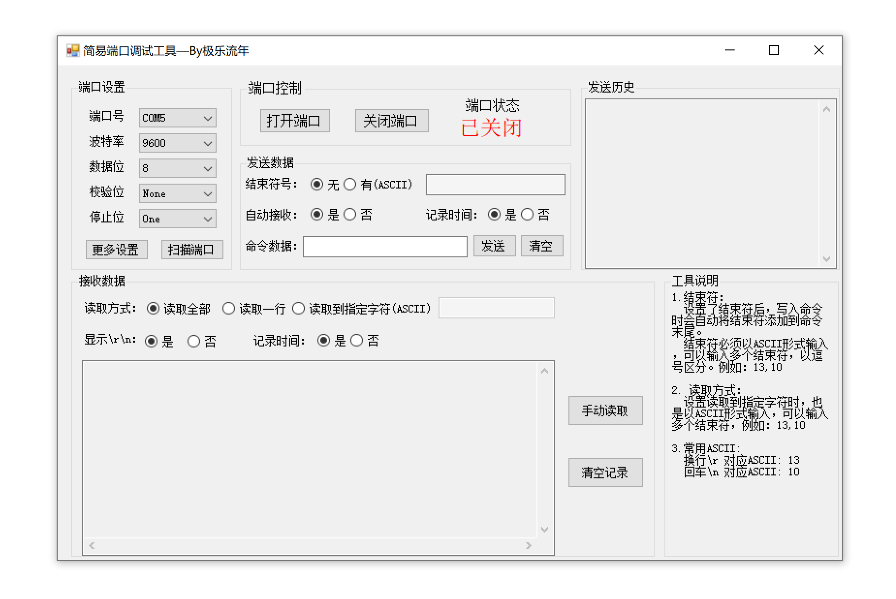

### 2.2 功能模块说明

#### 2.2.1 【端口设置】模块

* **校验位** 列表值说明：

    | 选项值  | 对应校验位 |
    | ------- | ---------- |
    | `None`  | 0          |
    | `Even`  | 1          |
    | `Odd`   | 2          |
    | `Mark`  | 3          |
    | `Space` | 4          |

* **停止位** 列表值说明：

    | 选项值         | 对应停止位 |
    | -------------- | ---------- |
    | `None`         | 0          |
    | `One`          | 1          |
    | `Two`          | 2          |
    | `OnePointFive` | 3          |

* **更多设置** 按钮

    点击会出现弹出框，在弹出框中可设置 读写的超时时间、以及读写的缓存区大小。

    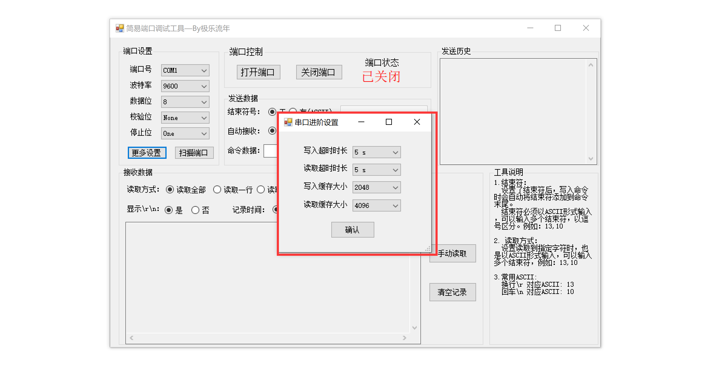

* **刷新端口** 按钮

    点击后：程序会重新检测电脑中所有可用端口，并默认选中列表中的第一个端口。

    

#### 2.2.2 【端口控制】模块

* **打开端口** 按钮

    点击后：程序开启对应端口。打开端口后，【端口设置】模块功能会被锁定无法使用。

    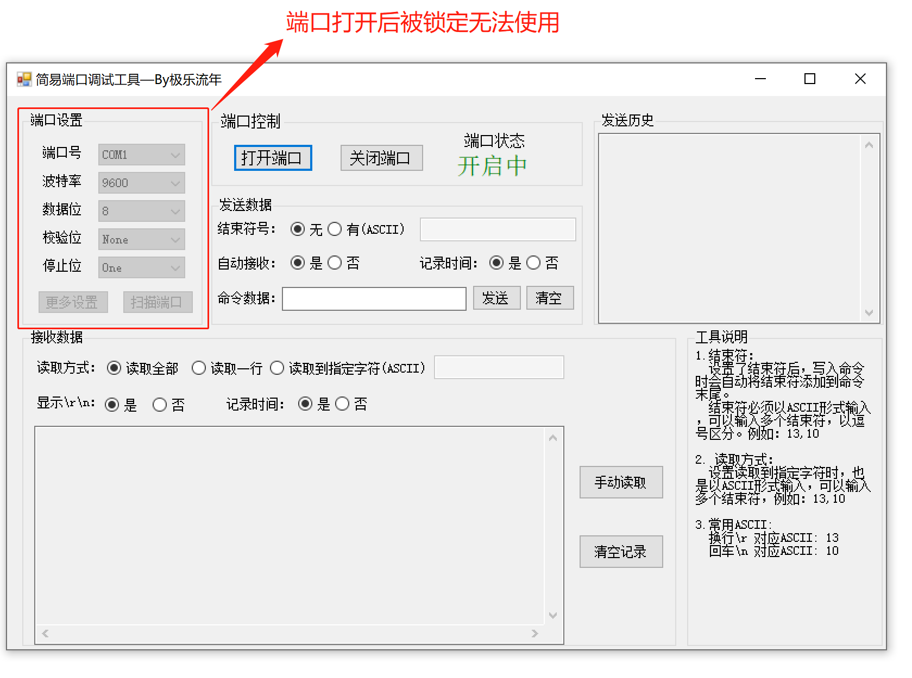

* **关闭端口** 按钮

    点击后：程序关闭对应端口。关闭端口后，【端口设置】模块功能会重新启用。

* **端口状态** 

    系统会自动识别端口的开启、关闭状态，并给出状态提示，检测频率为 1 s。

    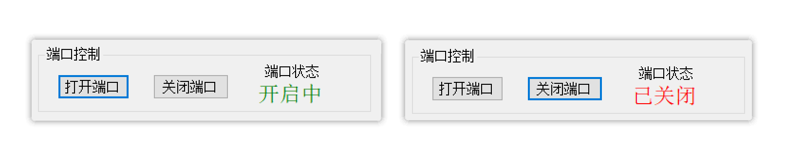

#### 2.2.3 【发送数据】模块

* **结束符号**

    有些设备给出的接口协议中，会设定某个字符作为一条命令的结束符。为了方便不用每次都手动输入结束符，可在这个位置提前设置好结束符，这样在发送命令时，程序会自动把结束符添加在命令末尾。

    为了避免自动转义，输入的结束符必须以 `ASCII` 形式输入。如果指定的结束符是字符串，则将输入的多个`ASCII` 以逗号分隔。

    例如：13,10

    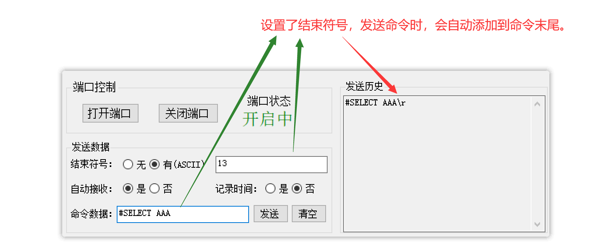

* **自动接收**

    选了自动接收之后，程序会自动接收设备传回的信息，并输出在下方的【数据接收】区域的提示框中。

* **记录时间**

    选了记录时间之后，界面右侧【发送历史】区域会记录我们每次发送命令的时间点。

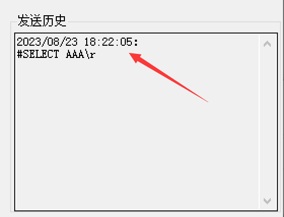

* **命令数据**

    输入我们要发送给端口的命令。如果有 \n \r 之类的特殊结束符，请使用上方的 **结束符号** 功能进行设置。

    因为手动输入斜杠 `\` 符号，在程序中会被转义。

* **发送数据** 按钮

    点击后：将我们在命令框中的命令，通过端口发送给设备。

    也可在光标处于命令数据输入框的时候，直接按回车键发送命令。

* **清空** 按钮

    清空右侧【发送历史】区域的消息。

    

#### 2.2.4 发送历史模块

* 每次发送命令给设备后，发送的命令会记录在右侧该区域。
* 命令显示会将我们设置的结束符也一并显示。

#### 2.2.5 接收数据模块

* **读取方式**

    `读取全部`：将此刻设备已写入缓存区的所有数据，一次性都读取出来。

    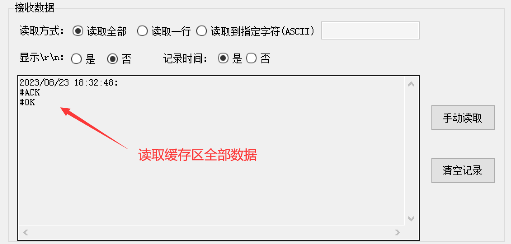

    `读取一行`：读取缓存区中一行数据，每次读取到换行符结束。

    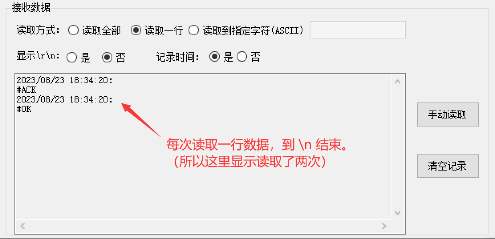

    `读取到指定字符`：读取缓存中的数据，直到读取到我们设定的字符后停止。设定方式也是 ASCII 形式，如果指定的是字符串，则将输入的多个ASCII 以逗号分隔。

    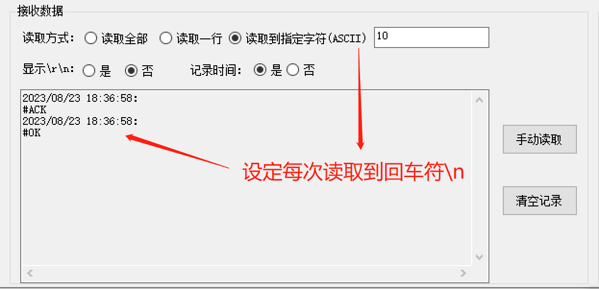

    > 注：当设置了自动接收时，如果采用 “读取全部“ 的方式，可能导致语句不连贯，如下图所示。
    >
    > 所以自动接收、手动接收、读取一行、读取到指定字符 这些设置需要根据不同设备进行灵活使用。

    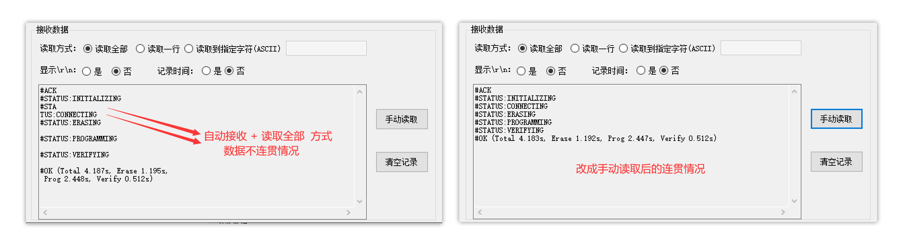

* **显示`\r \n`** 

    换行符、回车符 这两个字符比较常用，但它们属于不可见字符肉眼无法看见。

    为了方便查看，设置该选项后，如果接收的数据众存在这两个字符，则会以 \r 和 \n 形式显示出来。

    `\r` 符号，ASCII：13，表示换行。

    `\n`符号，ASCII：10，表示回车。 

    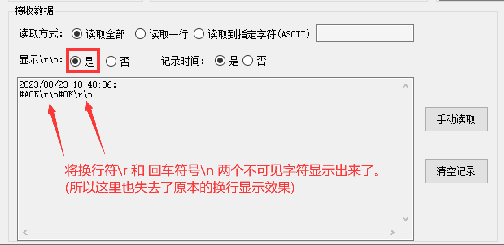

* **记录时间** 

    每次读取时，会记录读取到数据的时间。

* **手动读取** 按钮

    点击后：按设置的 "读取方式"  手动读取一次缓存区中的设备返回的数据。

* **清空记录** 按钮

    点击该按钮，清空接收数据区的历史记录数据。

    

## 3. 结束语

* 联系方式：

    Email：1727165836@qq.com

